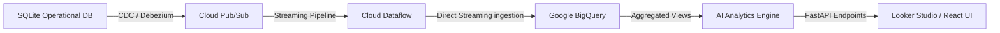

# Community Decision Intelligence & Analytics Architecture

This guide details the pipeline design, schema models, and Looker Studio connector patterns for the **Community Intelligence & Decision Analytics Platform** (Module 12) of CivicMind AI.

---

## 1. Data Pipeline Architecture (Google Cloud Native)

In production environments, the platform scales using Google Cloud's serverless analytics suite:



### Pipeline Nodes:
1. **CDC (Change Data Capture)**: Emits row updates from operational tables (`reports`, `emergency_incidents`, `users`, `ai_messages`) to Google Cloud Pub/Sub.
2. **Cloud Pub/Sub**: Serves as the high-throughput, real-time message buffer.
3. **Cloud Dataflow**: A managed Apache Beam runner that normalizes, cleanses, and streams records into BigQuery tables.
4. **Google BigQuery**: Serves as the enterprise data warehouse housing raw, historical, and aggregated tables.

---

## 2. BigQuery Database Schema Design

### 2.1. Fact Tables

#### `fact_citizen_reports`
- `report_id` (INTEGER, Primary Key)
- `complaint_id` (STRING)
- `category` (STRING)
- `priority` (STRING)
- `severity` (STRING)
- `status` (STRING)
- `ward_id` (INTEGER, ForeignKey)
- `citizen_id` (INTEGER, ForeignKey)
- `created_at` (TIMESTAMP)
- `resolved_at` (TIMESTAMP)
- `resolution_time_seconds` (INTEGER)

#### `fact_emergency_incidents`
- `incident_id` (INTEGER, Primary Key)
- `type` (STRING)
- `severity` (STRING)
- `status` (STRING)
- `ward_id` (INTEGER, ForeignKey)
- `latitude` (FLOAT)
- `longitude` (FLOAT)
- `ai_confidence` (FLOAT)
- `created_at` (TIMESTAMP)
- `resolved_at` (TIMESTAMP)

### 2.2. Dimension Tables

#### `dim_wards`
- `ward_id` (INTEGER, Primary Key)
- `name` (STRING)
- `city` (STRING)
- `population` (INTEGER)
- `polygon_geometry` (GEOGRAPHY)

#### `dim_ai_conversations`
- `session_id` (STRING, Primary key)
- `user_id` (INTEGER)
- `category` (STRING)
- `total_messages` (INTEGER)
- `avg_confidence` (FLOAT)

---

## 3. Looker Studio Connector Integration

To enable Looker Studio reports, we configure the **BigQuery BI Engine** for sub-second dashboards latency.

### Steps to Build Looker Studio Dashboards:
1. **Define BI Engine Reservoirs**:
   - In Google Cloud Console, navigate to BigQuery > BI Engine.
   - Allocate memory capacity (e.g. 10GB) targeting the CivicMind analytics dataset.
2. **Create Looker Data Sources**:
   - Open Looker Studio.
   - Connect using the native **Google BigQuery Connector**.
   - Select your Project ID > CivicMind Dataset > Custom SQL query or direct table view selection (`fact_citizen_reports` joined with `dim_wards`).
3. **Expose Custom Semantic Fields**:
   - **Resolution Rate %**: `SAFE_DIVIDE(COUNTIF(status IN ('Resolved', 'Closed')), COUNT(report_id))`
   - **Avg Resolution Days**: `SAFE_DIVIDE(SUM(resolution_time_seconds), COUNT(report_id)) / 86400.0`
   - **Criticality Score**: `COUNTIF(priority = 'Critical' OR priority = 'High')`

---

## 4. Decision Intelligence System Design

The decision support module maps current active report density and emergency incidents to localized policy recommendations.

```
                  [ Reports / Emergencies Density ]
                                 │
                                 ▼
                     [ Rule-based Aggregations ]
                                 │
                                 ▼
              [ AnalyticsInsightAgent Evaluation ]
                                 │
                                 ▼
          [ Actionable Decision Support Recommendations ]
            - Action Title & affected departments
            - Supporting evidence & confidence index
```

---

## 5. API Endpoints Reference

All endpoints require citizen/government authorization tokens.
- `GET /api/v1/analytics/dashboard`: Dynamic Ring Index Scores.
- `GET /api/v1/analytics/kpis`: Core numerical metrics summaries.
- `GET /api/v1/analytics/trends`: Monthly timelines and categories counts.
- `GET /api/v1/analytics/insights`: AI-generated trend summaries list.
- `GET /api/v1/analytics/recommendations`: Actionable decision cards.
- `GET /api/v1/analytics/scorecards`: Detailed ward/department table.
- `GET /api/v1/analytics/community`: Community participation indices.
- `GET /api/v1/analytics/summary?scope=city`: Executive markdown descriptions.
