# CivicMind AI — Authentication & User Management Architecture

This document describes the design, API contracts, security configurations, and frontend-backend flows for the enterprise-grade Authentication and User Management system (Module 2).

---

## 🔐 Authentication & Token Lifecycle

CivicMind AI utilizes a state-of-the-art token-based authentication mechanism combining:
- **Access Tokens**: Short-lived JSON Web Tokens (JWT) signed with HMAC-SHA256, carrying the user's ID, email, role, and zoning configurations.
- **Refresh Tokens**: Long-lived secure HttpOnly cookies to automatically refresh sessions.
- **Password Hashing**: Salted BCrypt (via `passlib` with `bcrypt` backend) to secure credentials at rest.

### Auth Sequence Flow

```mermaid
sequenceDiagram
    autonumber
    actor User as Client (Frontend)
    participant API as FastAPI Gateway
    participant DB as SQLite/PostgreSQL Database

    User->>API: POST /auth/login {email, password}
    API->>DB: Query user by email
    DB-->>API: User Record
    API->>API: Verify Password Hash
    
    rect rgb(20, 20, 30)
        Note over API: Generate JWT Access Token (15m expiry)<br/>Generate Refresh Token (7d expiry)
    end

    API-->>User: HTTP 200 OK + JSON Access Token + HttpOnly Cookie (Refresh Token)
    Note over User: Save Access Token in Memory/State

    loop API Requests
        User->>API: Authorized Request with Bearer Access Token
        API-->>User: Data Response
    end

    opt Access Token Expires (HTTP 401)
        User->>API: POST /auth/refresh (Cookie header sent automatically)
        API->>API: Validate Refresh Token
        API-->>User: HTTP 200 OK + New Access Token
    end
```



---

## 👥 Role-Based Access Control (RBAC)

The system supports four distinct user roles, each defining access permissions and specific layouts:

| Role | Access Level / Permission Context | Dashboard Wrapper | Key Operations Allowed |
| :--- | :--- | :--- | :--- |
| **Citizen** | Personal community engagement | `CitizenDashboard` | Report community issues, view personal reports, use AI Assistant, manage profile settings |
| **Government** | Municipal administration | `GovernmentDashboard` | View assigned reports, update issue status, access municipal analytics, export CSV reports |
| **NGO** | Community support coordination | `NgoDashboard` | View outreach heatmaps, register/track volunteer lists, coordinate NGO programs |
| **Admin** | System administration | `AdminDashboard` | Manage system settings, audit user actions, view global security reports, configure API keys |

### Protected Routes Wrapper (`/src/components/Protected.tsx`)

The frontend uses the `ProtectedRoute` wrapper to enforce role clearance before rendering components:
- If unauthenticated, users are redirected to `/login`.
- If authenticated but missing the required role, they are redirected to a permission-denied / dashboard landing page.

---

## 💾 Database Schema

The database model (`User` schema) is declared in [user.py](file:///c:/Users/OM%20TRIVEDI/Desktop/Google/app/models/user.py) and is compatible with both SQLite (local development) and PostgreSQL (production).

```sql
CREATE TABLE users (
    id VARCHAR(36) PRIMARY KEY,
    email VARCHAR(255) UNIQUE NOT NULL,
    hashed_password VARCHAR(255) NOT NULL,
    first_name VARCHAR(100) NOT NULL,
    last_name VARCHAR(100) NOT NULL,
    phone VARCHAR(50) NOT NULL,
    role VARCHAR(50) NOT NULL, -- 'Citizen', 'Government', 'NGO', 'Admin'
    city VARCHAR(100) NOT NULL,
    state VARCHAR(100) NOT NULL,
    country VARCHAR(100) NOT NULL,
    organization VARCHAR(255) NULL,
    avatar_url VARCHAR(255) NULL,
    is_active BOOLEAN DEFAULT TRUE,
    is_verified BOOLEAN DEFAULT FALSE,
    created_at TIMESTAMP DEFAULT CURRENT_TIMESTAMP,
    updated_at TIMESTAMP DEFAULT CURRENT_TIMESTAMP
);
CREATE INDEX idx_users_email ON users(email);
```

---

## 🔌 API Documentation (FastAPI Routes)

All routes are rate-limited and secured. Global CORS policies allow secure cross-origin communication between the Vite server and FastAPI gateway.

### 🔑 Authentication Routes (`/auth`)

* **`POST /auth/register`**
  - **Description**: Registers a new user account.
  - **Request Body**: `UserCreate` Pydantic payload.
  - **Response**: `UserOut` Pydantic payload.

* **`POST /auth/login`**
  - **Description**: Authenticates credentials and returns access and refresh tokens.
  - **Request Body**: OAuth2 Password Request Form (`username` represents email, `password`).
  - **Response**: JWT Access Token structure + HttpOnly refresh cookie.

* **`POST /auth/logout`**
  - **Description**: Standard logout; invalidates session cookies.
  - **Response**: Success status.

* **`POST /auth/refresh`**
  - **Description**: Rotates access tokens using the HttpOnly refresh cookie.
  - **Response**: New Access Token.

* **`POST /auth/forgot-password`**
  - **Description**: Triggers a password reset request.
  - **Request Body**: `{ "email": "..." }`
  
* **`POST /auth/reset-password`**
  - **Description**: Finalizes a password reset using the token payload.
  - **Request Body**: `{ "token": "...", "new_password": "..." }`

* **`POST /auth/verify-email`**
  - **Description**: Confirms user's email verification using a validation token.
  - **Request Body**: `{ "token": "..." }`

### 👤 Profile & Account Routes (`/user`)

All routes in this group require a valid HTTP Bearer Access Token.

* **`GET /user/profile`**
  - **Description**: Retrieves the active user record.
  - **Response**: `UserOut` model.

* **`PUT /user/profile`**
  - **Description**: Modifies user profile attributes (names, location, contact, organization).
  - **Request Body**: `UserUpdate` model.
  - **Response**: Updated `UserOut` model.

* **`PUT /user/password`**
  - **Description**: Secures password rotations. Requires old password verification.
  - **Request Body**: `{ "old_password": "...", "new_password": "..." }`

* **`POST /user/avatar`**
  - **Description**: Uploads a profile avatar. Stores images securely.
  - **Request Body**: Multipart form data (`file`).
  - **Response**: `{ "avatar_url": "..." }`

* **`DELETE /user/account`**
  - **Description**: Permanently deletes the user record from the system database.

---

## 🎨 Frontend Architecture

The React client implements the authentication flow through a clean context wrapper:

1. **`AuthContext` (`/src/context/AuthContext.tsx`)**:
   - Manages global state: `currentUser`, `isAuthenticating`, and `isAuthenticated`.
   - Exposes asynchronous workflows: `login()`, `register()`, `logout()`, `updateProfile()`, `changePassword()`, `deleteAccount()`, and `refreshSession()`.
   - Intercepts requests to automatically attach authorization headers.

2. **Access Control Layout**:
   - Redirects to page boards according to role:
     - **Citizen**: `CitizenDashboard.tsx`
     - **Government**: `GovernmentDashboard.tsx`
     - **NGO**: `NgoDashboard.tsx`
     - **Admin**: `AdminDashboard.tsx`

3. **Views & Forms**:
   - `/login` and `/register` use modern glassmorphic inputs, validation indicators, and real-time password strength meters.
   - `/profile` and `/account-settings` support interactive profile updates, avatar uploads, and irreversible account terminations with confirmation alerts.
