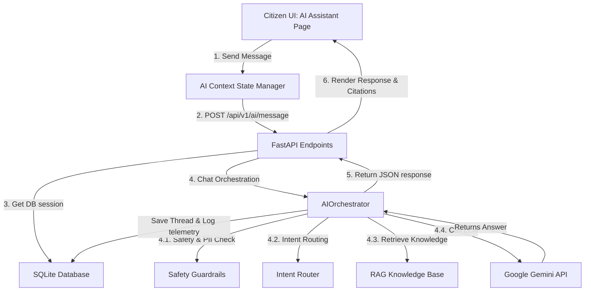

# CivicMind AI — Module 8: Citizen Assistant AI Agent (Google ADK + Gemini)

This documentation outlines the design, architecture, database schemas, APIs, and React frontend components of the enterprise-grade Citizen Assistant AI Agent.

---

## 1. System Overview & Architecture

The **Citizen Assistant AI Agent** establishes a persistent, conversational AI partner for citizens using the Google Gen AI API (Gemini 2.5 Flash). It functions as the entry point for citizen interactions, classifying intents, providing answers backed by local knowledge base references, executing tasks via tools, and persisting conversation histories.

---

## 2. Database Models & Schema Design

Persistent conversations and messages are stored in two relational models:

### 2.1. AIConversation Model (`ai_conversations` table)
Tracks individual chat threads and groups.
- `id` (Integer, Primary Key)
- `title` (String 150): Auto-generated from the first query text
- `user_id` (ForeignKey to `users.id`): Owner of the chat thread
- `is_pinned` (Boolean): Allows pinning thread to the top of sidebars
- `category` (String 50): Mapped intent classification category
- `created_at`, `updated_at` (DateTime)

### 2.2. AIMessage Model (`ai_messages` table)
Stores individual messages belonging to a conversation.
- `id` (Integer, Primary Key)
- `conversation_id` (ForeignKey to `ai_conversations.id`)
- `sender` (String 20): `user` / `agent` / `system`
- `text` (Text)
- `timestamp` (DateTime)
- `agent_name` (String 50): Name of the executing agent (e.g. `CitizenAssistant`)
- `category` (String 50): intent category
- `confidence` (Float): Confidence level of intent routing/answer
- `tokens_used` (Integer): Sum of prompt + response tokens
- `is_safety_violation` (Boolean): Flagged if query/response hits safety barriers
- `feedback` (String 20): `like` / `dislike` / `None`
- `knowledge_sources` (JSON): RAG document reference matches
- `tool_calls` (JSON): Logs of any tool executed during task execution

---

## 3. REST API Documentation

The backend endpoints are implemented inside `app/api/ai.py` and are secured with JWT dependencies.

| Method | Endpoint | Description | Roles |
|---|---|---|---|
| `POST` | `/api/v1/ai/conversation` | Create a new persistent chat thread. | Citizen, NGO, Government |
| `GET` | `/api/v1/ai/history` | Retrieve conversation thread lists of the user. | Citizen, NGO, Government |
| `POST` | `/api/v1/ai/message` | Send query, execute orchestrator and get agent reply. | Citizen, NGO, Government |
| `GET` | `/api/v1/ai/conversation/{id}` | Get full details of a thread (with message exchange history). | Thread owner |
| `POST` | `/api/v1/ai/conversation/{id}/pin` | Pin/unpin a thread in the sidebar lists. | Thread owner |
| `DELETE` | `/api/v1/ai/conversation/{id}` | Permanently delete a conversation thread and its messages. | Thread owner |
| `POST` | `/api/v1/ai/feedback` | Submit like/dislike satisfaction feedback for a message. | Thread owner |
| `GET` | `/api/v1/ai/suggestions` | Fetch context-aware quick chat prompt card topics. | Citizen, NGO, Government |
| `GET` | `/api/v1/ai/session` | Get active memory logs and session context variables. | Thread owner |

---

## 4. Frontend Component & Service Structure

The frontend user interface is modularized across service adapters and context providers:

1. **`aiService.ts`**: Handles network fetch requests to backend endpoints like `/conversation`, `/message`, `/feedback`, and `/suggestions`.
2. **`AIContext.tsx`**: Manages React state parameters for the current thread, list of threads, loading indicators, active suggestions, and maps new SQLite database model structures to legacy memory layouts for backwards compatibility.
3. **`AiAssistantPage.tsx`**: Renders a premium interface:
   - **Collapsible Sidebar**: Lists active conversations categorized by updated time, pin options, and delete options.
   - **Chat Feed**: Displays user query chips and agent response cards featuring typewriter anims, intent category indicators, confidence badges, tool log expanders, and feedback buttons.
   - **Suggested Chips**: Clicking a chip sends the preset query immediately.
   - **RAG Citation Cards**: Renders accordion-style maps showing source titles and highlights of files used to answer the question.
