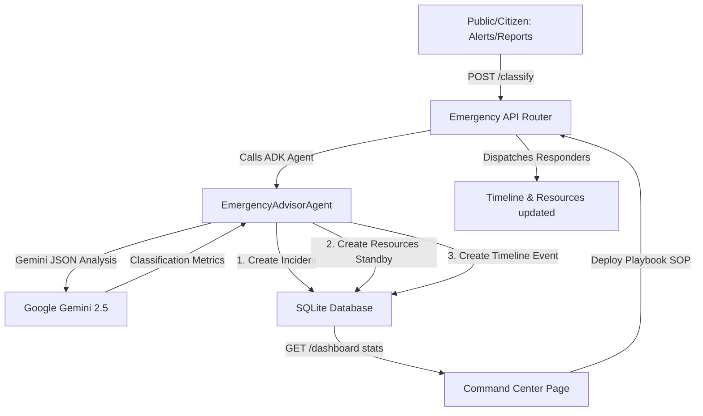

# CivicMind AI — Module 9: Emergency Intelligence AI Agent & Incident Command Center

This guide documents the design, architecture, schemas, playbooks, API endpoints, and visual interfaces of the Emergency Intelligence AI module.

---

## 1. System Overview & Architecture

The **Emergency Intelligence AI Agent** coordinates local safety SOP guides during community emergencies (e.g. fire hazard, gas leak, flooding). Acting as a digital emergency coordinator, it extracts information from descriptions, estimates incident severity and priority queues, recommends dispatch resources, and updates the Command Center dashboard.

---

## 2. Database Models & Schema Design

Relational persistence is handled in `app/models/emergency.py` through three tables:

### 2.1. EmergencyIncident Model (`emergency_incidents`)
- `id` (Integer, Primary Key)
- `report_id` (ForeignKey to `reports.id`, Nullable)
- `title` (String 150), `description` (Text)
- `type` (String 50): Fire, Flood, Gas Leak, Earthquake, Landslide, Chemical Leak, Cyclone, Road Accident, Public Violence, etc.
- `severity` (String 20): Minor, Moderate, High, Critical, Catastrophic
- `priority` (String 20): Low, Medium, High, Urgent, Emergency, Critical
- `status` (String 30): Reported, Verified, Assigned, Response Started, Resources Deployed, Citizen Updated, Resolved, Closed
- `latitude`, `longitude` (Float), `address` (String), `ward` (String)
- `affected_radius_meters` (Float): Calculated hazard boundary
- `ai_confidence` (Float): Confidence indicator of classification
- `ai_reasoning` (Text): Rationale context summary
- `suggested_departments` (JSON): Suggested agencies
- `estimated_response_minutes` (Integer): Response ETA
- `escalation_level` (Integer): Increments on manual overrides

### 2.2. EmergencyTimelineEvent Model (`emergency_timeline_events`)
- `id` (Integer, Primary key)
- `incident_id` (ForeignKey to `emergency_incidents.id`)
- `event` (String): Timeline step tags
- `note` (Text): Log annotation
- `timestamp` (DateTime)

### 2.3. EmergencyResource Model (`emergency_resources`)
- `id` (Integer, Primary Key)
- `incident_id` (ForeignKey to `emergency_incidents.id`)
- `name` (String): Team designation (e.g. Fire Team B)
- `type` (String): Fire Teams, Medical Teams, Police, Engineers, Disaster Response, etc.
- `status` (String): Standby, Dispatched, On Site, Released
- `allocated_count` (Integer)

---

## 3. Incident Triage Matrices

### 3.1. Severity Levels
1. **Minor** (Blue): Low risk, negligible impact.
2. **Moderate** (Green): Contained event, standard resolution.
3. **High** (Yellow): Large impact, potential hazard.
4. **Critical** (Orange): Significant damage, public threat.
5. **Catastrophic** (Red): Extreme hazard, evacuation required.

### 3.2. Priority Levels
1. **Low / Medium** (Blue/Green): Monitored queue.
2. **High / Urgent** (Yellow/Orange): Accelerated response.
3. **Emergency / Critical** (Rose/Red): Immediate dispatch.

---

## 4. Emergency Response Playbooks

Predefined response workflows are loaded:

| Playbook | Immediate Actions | Responsible Departments | Required Resources |
|---|---|---|---|
| **Flood Response** | Dispatch boats, direct evacuation, setup drinking checkpoints | Disaster Management, Water Department | Boats, Sandbags, Water Tanks |
| **Fire Rescue** | Evacuate occupants, verify hydrants, close gas lines | Fire Department, Police | Firetrucks, Hoses, Respirators |
| **Chemical/Gas Safety** | Establish hazard zones, disable power grids, advise alerts | Fire Department, Environmental Department | Hazmat Suits, Evacuation buses |
| **Road Accident** | Dispatch traffic routing, dispatch ambulances, clean roads | Traffic Police, Medical Services | Ambulances, Traffic Cones |

---

## 5. API Documentation

| Method | Endpoint | Description | Scope |
|---|---|---|---|
| `POST` | `/api/v1/ai/emergency/analyze` | Returns zero-shot incident parameters from a text query. | Government, Citizen |
| `POST` | `/api/v1/ai/emergency/classify` | Classifies and records a new emergency, staging standby resources. | Government, Citizen |
| `POST` | `/api/v1/ai/emergency/respond` | Triggers playbook dispatch, moving resource states to Dispatched. | Government |
| `GET` | `/api/v1/ai/emergency/incidents` | Lists active emergency queues. | Government, NGO |
| `GET` | `/api/v1/ai/emergency/timeline` | Returns operational logs list for an incident. | Government, Citizen |
| `GET` | `/api/v1/ai/emergency/resources` | Returns standby or dispatched resources list. | Government |
| `GET` | `/api/v1/ai/emergency/dashboard` | Computes telemetry statistics (counts, averages, workloads). | Government |
| `POST` | `/api/v1/ai/emergency/incidents/{id}/override` | Allows manual adjustment of triage severity and priorities. | Government |
