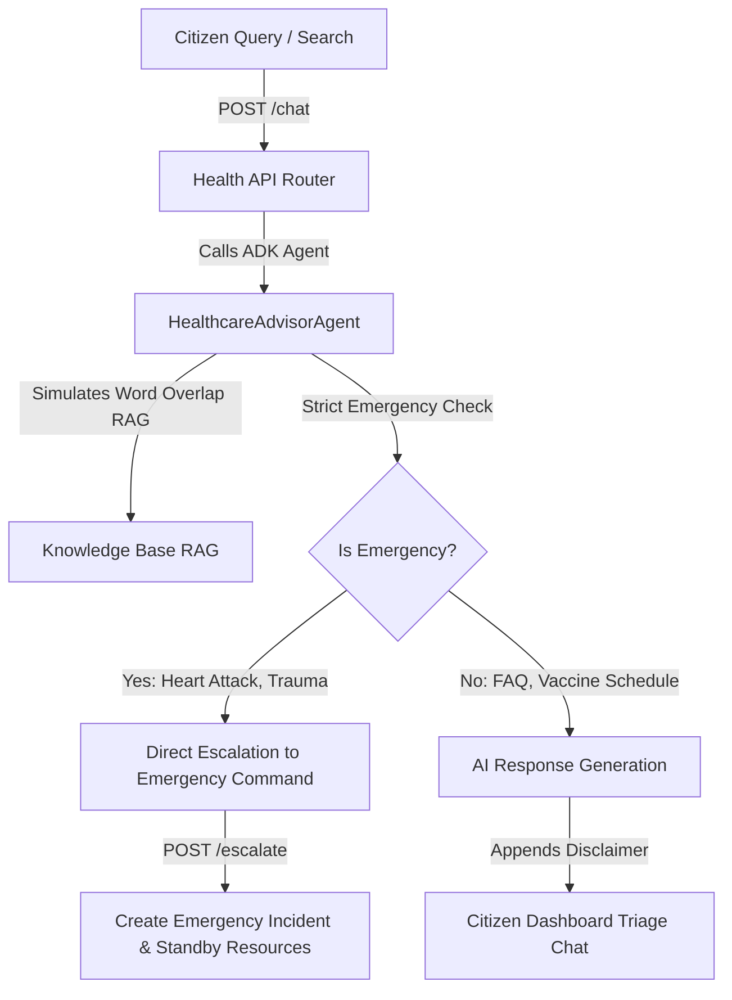

# CivicMind AI — Module 10: Healthcare & Public Health Intelligence Agent

This document outlines the architecture, schemas, strict medical safety policies, retrieval-augmented generation (RAG) structures, and API endpoints for the Healthcare & Public Health Intelligence Module.

---

## 1. System Overview & Architecture

The **Healthcare & Public Health Intelligence Agent** provides citizens with health FAQ triage, preventative health programs, public safety advisories, and nearby medical facility search capabilities.



---

## 2. Medical Safety Guardrails

To prevent safe-use violations, the Healthcare Intelligence Agent strictly enforces the following policies:

1. **No Medical Diagnosis**: The agent never states a user has a specific disease or condition. It focuses on symptoms description and directs users to local facilities.
2. **No Prescriptions**: The agent never recommends specific drug names, dosages, or chemical remedies.
3. **Safety Disclaimers**: Every output from the AI assistant automatically appends the legal notice:
   > *Disclaimer: CivicMind AI provides public health information and first-aid safety guidelines. It does NOT provide medical diagnoses or prescribe medications. This does not replace professional medical consultation. If you are experiencing a medical emergency, please call 108 or 911 immediately.*
4. **Active Emergency Triage**: Queries indicating acute life-threatening situations (e.g. "chest pain", "shortness of breath", "severe bleeding", "loss of consciousness") flag the message as an emergency. The system immediately unlocks a direct ambulance dispatch button.

---

## 3. Knowledge Retrieval & RAG Architecture

The local knowledge base in `app/ai/knowledge/layer.py` contains pre-seeded documents utilized for query similarity calculations:

- **General Health Info (doc_id: `health_faq`)**: General wellness, clinic discovery instructions, and clinic locations.
- **Emergency First Aid Guide (doc_id: `health_first_aid`)**: CPR steps, burns, minor wound management, choking relief.
- **Heatwave Advisory (doc_id: `health_heatwave`)**: Hydration directives, clothing precautions.
- **Air Quality Guidance (doc_id: `health_aqi`)**: Wear N95 masks when AQI exceeds 150, air purifiers advice.
- **National Health Mission (doc_id: `health_nhm`)**: Public primary healthcare cards details, Janani Suraksha maternal scheme.
- **Vaccination Schedules (doc_id: `health_vaccine`)**: BCG, OPV, Pentavalent, Rotavirus, MR calendar timings.
- **Mental Health Helpline (doc_id: `health_mental`)**: Free Kiran counseling hotline contacts.

---

## 4. API Layer Documentation

### 4.1. POST `/api/v1/ai/health/chat`
Triages a health query using the healthcare agent.
- **Request Body**:
  ```json
  {
    "query": "What vaccines are needed for a 6 week old baby?",
    "session_id": "optional_session_uuid"
  }
  ```
- **Response**:
  ```json
  {
    "response": "Based on local vaccine calendars, at 6 weeks infants should receive OPV 1, Pentavalent 1, Rotavirus 1, and PCV 1... [Disclaimer appended]",
    "category": "Healthcare",
    "agent": "HealthcareAdvisor",
    "safety": {"safe": true, "reason": "Passed Health Safety Guardrails"},
    "confidence": 0.95,
    "analysis": {
      "is_emergency": false,
      "emergency_type": "None",
      "severity": "Minor",
      "intent": "Vaccination Information",
      "confidence_score": 0.95
    }
  }
  ```

### 4.2. GET `/api/v1/ai/health/facilities`
Discovers nearby healthcare facilities.
- **Query Parameters**:
  - `lat` (float, optional): Latitude
  - `lng` (float, optional): Longitude
  - `radius_km` (float, default 5.0): Search range
  - `type` (string, optional): Hospital, Clinic, Pharmacy, Blood Bank, Diagnostic Center
- **Response**:
  ```json
  [
    {
      "id": 1,
      "name": "UCSF Medical Center",
      "type": "Hospital",
      "address": "505 Parnassus Ave, San Francisco, CA 94143",
      "latitude": 37.7631,
      "longitude": -122.4578,
      "contact": "(415) 476-1000",
      "distance_km": 1.25,
      "estimated_travel_time_minutes": 6
    }
  ]
  ```

### 4.3. GET `/api/v1/ai/health/hospitals`
Shortcut to fetch only hospitals. Supports same parameters as `/facilities`.

### 4.4. GET `/api/v1/ai/health/pharmacies`
Shortcut to fetch only pharmacies. Supports same parameters as `/facilities`.

### 4.5. GET `/api/v1/ai/health/advisories`
Fetch active public health advisories (e.g. Heatwaves, AQI warnings).

### 4.6. GET `/api/v1/ai/health/programs`
Fetch government immunization calendars and maternity welfare programs.

### 4.7. GET `/api/v1/ai/health/resources`
Fetch first aid guides, mental health helpline contacts, and seasonal disease prevention FAQs.

### 4.8. POST `/api/v1/ai/health/escalate`
Directly escalates a critical health incident to the Emergency Command Center.
- **Request Body**:
  ```json
  {
    "title": "Severe Breathlessness",
    "description": "Citizen reporting severe respiratory distress at Richmond District.",
    "latitude": 37.7788,
    "longitude": -122.4795,
    "address": "711 Van Ness Ave",
    "ward": "Ward 1 - Richmond"
  }
  ```
- **Response**:
  ```json
  {
    "status": "success",
    "message": "Emergency medical dispatch initiated.",
    "incident_id": 4,
    "incident": {
      "id": 4,
      "title": "Health Emergency: Severe Breathlessness",
      "type": "Medical Emergency",
      "severity": "Critical",
      "priority": "Urgent",
      "status": "Reported"
    }
  }
  ```

---

## 5. Healthcare Workflow Guide

1. ** Triage & Assessment**: When a query enters `/chat`, the orchestrator filters the request. If symptoms match cardiac/respiratory emergency profiles, a glowing Red Alert prompt invites the user to dispatch an ambulance.
2. **Escalation**: Confirming escalation triggers a POST to `/escalate`. This inserts an incident into the active database, logs a timeline event, and places paramedic/ambulance resources on Standby.
3. **Information Retrieval**: If the query is non-emergency (e.g., vaccine schedule or heatwave prevention), the RAG engine queries pre-seeded public databases and appends the safety disclaimer.
4. **Amenities Discovery**: When searching for nearby healthcare facilities, the map computes travel times and routing directions to hospitals, pharmacies, clinics, and blood banks.
