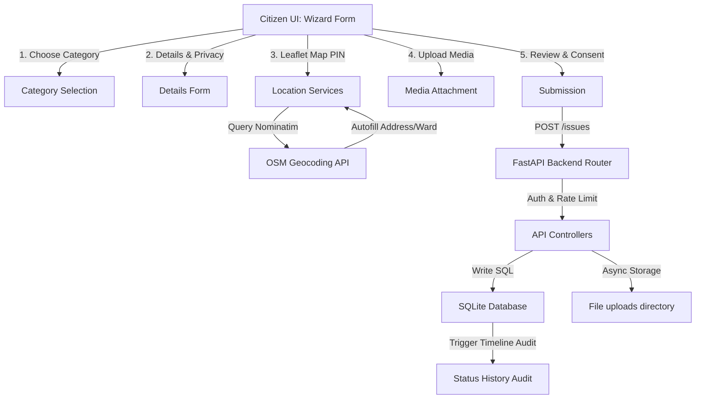

# CivicMind AI — Module 5: Smart Issue Reporting & Community Complaint Management

This documentation outlines the design, architecture, database schemas, APIs, and React frontend components of the enterprise-grade civic issue reporting and complaint management module.

---

## 1. System Overview & Architecture

The **Smart Issue Reporting System** provides a seamless channel for citizens to report local infrastructure, safety, or environmental issues, while routing structured tickets to target government departments for inspection, assignment, and resolution.

---

## 2. Database Models & Schema Design

The system maps data into four primary relational models built on **SQLAlchemy**:

### 2.1. Report Model (`reports` table)
Stores the core complaint details, geolocations, departmental routings, and assignment variables.
- `id` (Integer, Primary Key)
- `complaint_id` (String, unique): E.g., `CIV-A1B2C3D4`
- `tracking_number` (String, unique): E.g., `TRK-A1B2C3D4E5`
- `title` (String 150, required)
- `description` (Text, required)
- `category` (String 50, required)
- `priority` (String 20): Low / Medium / High / Critical
- `severity` (String 20): Minor / Moderate / Major / Emergency
- `status` (String 30): Submitted / Verified / Assigned / In Progress / Under Inspection / Resolved / Closed / Rejected
- `progress` (Integer): 0% to 100% resolution timeline indicator
- `address`, `ward`, `city`, `state`, `postal_code` (Strings for location breakdown)
- `latitude`, `longitude` (Floats for Leaflet map reference)
- `is_anonymous` (Boolean): If true, reporter details are hidden from public views
- `contact_method` (String): email / phone / none
- `assigned_department` (String)
- `assigned_officer_id` (ForeignKey to `users.id`)
- `citizen_id` (ForeignKey to `users.id`)
- `estimated_response_hours` (Integer)
- `resolved_at` (DateTime)

### 2.2. Attachment Model (`attachments` table)
Stores evidence files associated with specific reports.
- `id` (Integer, Primary Key)
- `report_id` (ForeignKey to `reports.id`)
- `filename` (String)
- `original_name` (String)
- `file_path` (String)
- `file_type` (String): image / video / document
- `mime_type` (String)
- `file_size` (BigInteger)

### 2.3. StatusHistory Model (`status_history` table)
Audit trail of every single workflow change.
- `id` (Integer, Primary Key)
- `report_id` (ForeignKey to `reports.id`)
- `changed_by_id` (ForeignKey to `users.id`)
- `old_status`, `new_status` (Strings)
- `note` (Text)
- `created_at` (DateTime)

---

## 3. REST API Documentation

The backend endpoints are implemented inside `app/api/issues.py` and enforce **RBAC** (Role-Based Access Control) using FastAPI dependencies.

| Method | Endpoint | Description | Allowed Roles |
|---|---|---|---|
| `POST` | `/api/v1/issues` | Create a new issue report. | Citizen, NGO |
| `GET` | `/api/v1/issues` | Search, filter, and paginate reports. | Citizen (own only), Gov/Admin (all) |
| `GET` | `/api/v1/issues/{id}` | Fetch full issue details (with history/files). | Citizen (own only), Gov/Admin (all) |
| `PUT` | `/api/v1/issues/{id}` | Update editable details (before processing). | Citizen (owner only) |
| `DELETE` | `/api/v1/issues/{id}` | Withdraw/soft-delete a report. | Citizen (owner only) |
| `POST` | `/api/v1/issues/{id}/status` | Update issue status & record audit log. | Government, Admin |
| `GET` | `/api/v1/issues/{id}/history` | Fetch status audit trail list. | Citizen (owner), Gov/Admin (all) |
| `POST` | `/api/v1/issues/{id}/attachments` | Upload up to 6 evidence files. | Citizen, NGO |
| `DELETE` | `/api/v1/issues/{id}/attachments/{att_id}` | Remove a single attachment file. | Citizen (owner) |
| `GET` | `/api/v1/issues/track/{complaint_id}` | Public endpoint to track by complaint ID. | Public (No Auth) |

---

## 4. Frontend Component Hierarchy

The issue reporting module is organized under `src/components/issues` and `src/pages/issues`:

1. **`ReportIssuePage.tsx`**: Multi-step reporting wizard with smooth transitions powered by Framer Motion.
2. **`IssueDetailPage.tsx`**: Renders complaint metadata, status stepper progress, attachments grid, timeline events list, and location maps.
3. **`MyReports.tsx`**: Citizen reporting dashboard with advanced date-range parameters, ward criteria, sorting, and pagination.
4. **`LocationPicker.tsx`**: Draggable Leaflet map centering, address searches, and Nominatim API hook-ups.
5. **`MediaUploader.tsx`**: File drag-and-drop, inline file replacing, and HTML mobile device camera hooks.
6. **`IssueCard.tsx`**: Premium card component representing a single issue in lists, supporting quick share and receipt downloading.

---

## 5. Map & Geocoding Integration Details

The map system integrates **Leaflet** tiles using the `react-leaflet` wrapper:
- **Marker Dragging**: Automatically grabs coordinate shifts on drag-end and fires Nominatim reverse-geocoder to extract street name, ward, landmark, city, and state.
- **Address Autocomplete**: Geocodes text inputs using Nominatim's search endpoint and moves the map viewport focus.
- **Fail-safe Fallback**: In the event of connection timeouts or API blocks, coordinates are translated into simulated addresses so the form never fails.
- **Custom Pulse Marker**: Set up using a custom `L.divIcon` styled with CSS animations (`animate-ping`) to match the portal's premium glassmorphism theme.
