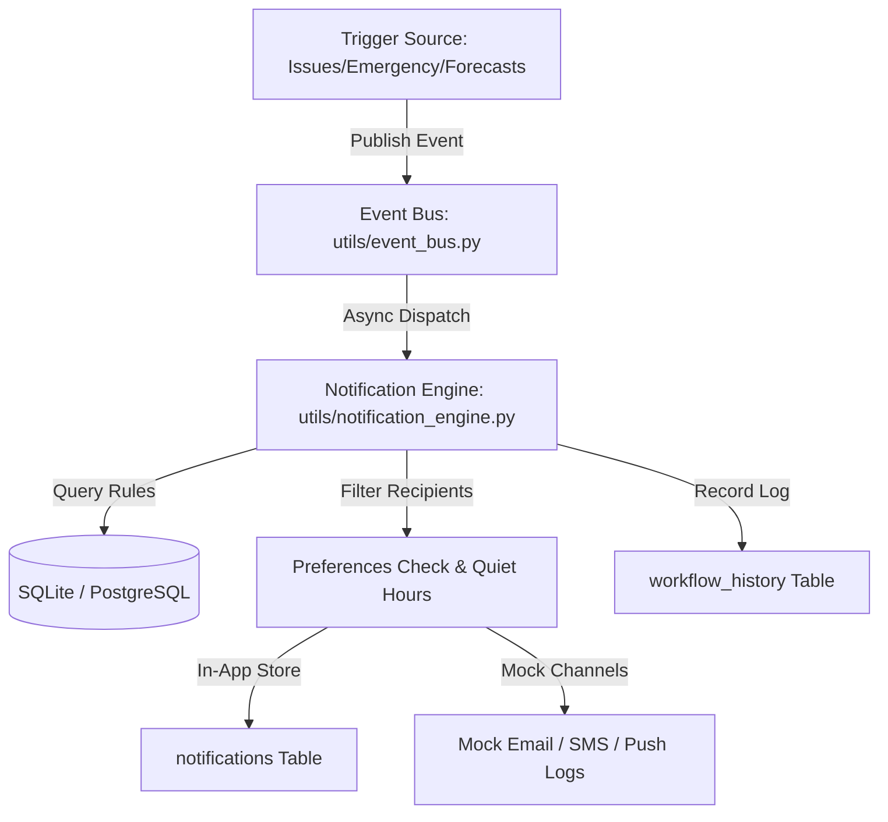

# Smart Notifications & Workflow Automation Engine Guide

This document describes the design and integration of the Smart Notifications, Alerting & Workflow Automation Engine (Module 14) inside CivicMind AI.

---

## 1. System Architecture

The notification and automation platform is built around an internal Pub/Sub Event Bus:

---

## 2. Component Layout

- **`app/models/workflow.py`**: DB tables tracking user channel preferences, automation rules, and history execution logs.
- **`app/utils/event_bus.py`**: Asynchronous, concurrent Pub/Sub signal router.
- **`app/utils/notification_engine.py`**: Dispatches notifications by checking condition parameters, targeting user roles, evaluating quiet hours, and writing mock alerts to standard output.
- **`app/api/notification_api.py`**: Exposes FastAPI endpoints under `/api/v1/notifications` for retrieving feeds, toggling preferences, deploying rules, and simulating events.
- **`src/context/NotificationCenterContext.tsx`**: Manages persistent in-app notifications feeds, preferences cache, and active workflows in React.
- **`src/pages/dashboards/NotificationCenterPage.tsx` & `WorkflowBuilderPage.tsx`**: Premium glassmorphic SaaS interfaces for notification alerts inbox, quiet-hours customization, sandbox simulation console, and rule audits log.

---

## 3. Automation Events & Formats

### Supported Events
- `issue_created`
- `issue_updated`
- `emergency_triggered`
- `health_advisory_published`
- `scheme_recommended`
- `prediction_generated`

### Dynamic Formatting
Rules support templated strings parsed with event payload variables:
- **Title template**: `Critical Emergency: {title}`
- **Message template**: `Incident at ward {ward_id} requires immediate support: {description}`

---

## 4. Quiet Hours & Suppressions

Quiet hours enforce strict noise control for Citizens and Officers:
- Users customize their sleep schedules (e.g., `22:00` to `07:00`).
- If an event triggers during a user's quiet hours:
  - **In-App notifications** are still generated and stored in the database.
  - **Email, SMS, and Push** alerts are suppressed to prevent immediate device alerts.
  - An indicator is stored in `WorkflowHistory` showing that delivery was suppressed.
