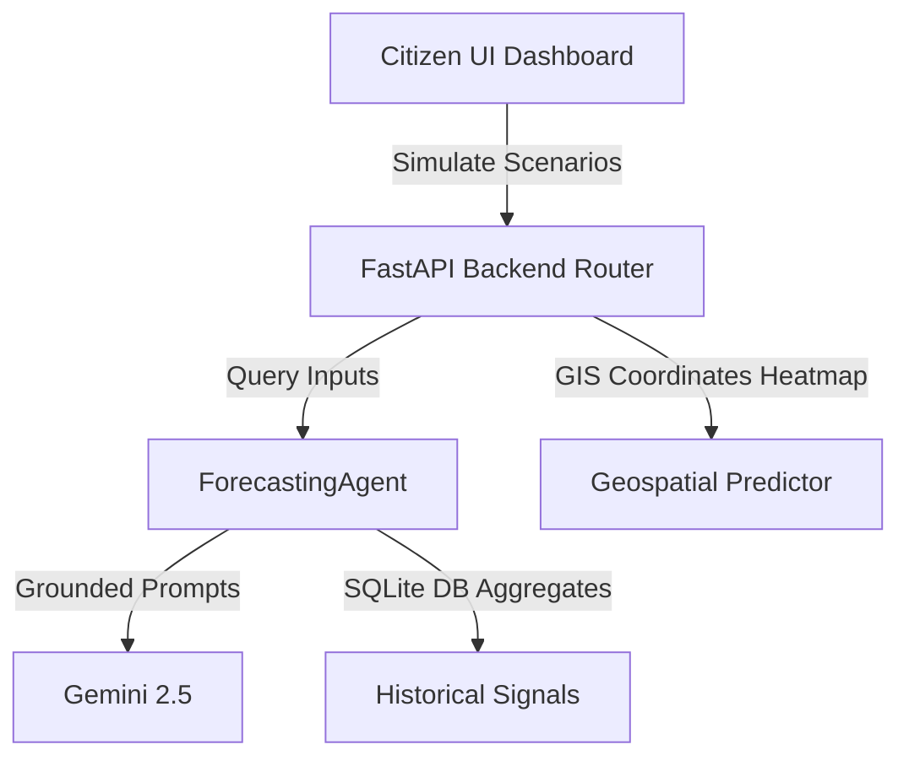

# Predictive Intelligence & Forecasting Engine Developer Guide

This document describes the design, implementation, and interfaces of the **Predictive Intelligence & Forecasting Engine** (Module 13) for CivicMind AI.

## Architectural Overview

The Forecasting Engine utilizes time-series calculations and Gemini explainability models to project future trends, identify early warning patterns, and simulate scenario adjustments:

---

## 1. Predictive Models & Scenario Simulations

CivicMind AI employs a probabilistic forecasting system. Predictions are never presented as absolute certainties but as expected trends with confidence indicators.

### 1.1. Scenario Simulation Formulas
Simulation settings (Sanitation staff addition $S$, Road maintenance teams $M$, Awareness Campaigns $C$) simulate workload reduction and department readiness boost:

$$\text{Workload Reduction \%} = \min(S \times 4 + M \times 6 + (12 \text{ if } C \text{ else } 0), 65\%)$$
$$\text{Department Readiness Boost \%} = \min(S \times 3 + M \times 5 + (8 \text{ if } C \text{ else } 0), 50\%)$$
$$\text{Estimated Response Speed Reduc (mins)} = \min(S \times 1.5 + M \times 2.0 + (3 \text{ if } C \text{ else } 0), 25 \text{ mins})$$

---

## 2. Early Warning Detection Framework

The Early Warning Engine identifies emerging patterns in real-time by analyzing short-term spikes in complaints and medical inquiries:
- **Road Failures**: Spikes in local road reports over 48 hours.
- **Hygiene & Sanitation**: Garbage complaint density rise over 7 days.
- **Healthcare demand**: Spikes in pediatric vaccine scheduler inquiries in the AI chat history.

Each alert provides confidence metrics, affected location polygons coordinates, and suggested preventive dispatch workflows.

---

## 3. API Endpoints Reference

All endpoints require citizen/government authorization tokens.
- `GET /api/v1/forecast/dashboard`: Exposes Overall Forecast Index and readiness indexes.
- `GET /api/v1/forecast/trends?range=7days`: Projections timelines by domain (Infrastructure, Emergency, Health).
- `GET /api/v1/forecast/risks`: Likelihood, severity, and impacted population parameters.
- `GET /api/v1/forecast/warnings`: Emergent warning triggers list.
- `GET /api/v1/forecast/recommendations`: Preventive actions list.
- `POST /api/v1/forecast/scenario`: Computes simulation policy variables outcomes.
- `GET /api/v1/forecast/confidence`: Retrieving overall accuracy indices.
- `GET /api/v1/forecast/geospatial`: Heatmap coordinate pins list.

---

## 4. UI Page Layout & Components

The **Predictive Engine** dashboard is divided into 6 interactive workspaces:
1. **Overview Risks**: Ring charts displaying indices and recommended human review flags.
2. **Forecast Explorer**: Interactive Recharts graphs with date ranges.
3. **Risk Matrix**: Scatter plots of likelihood vs severity.
4. **Scenario Simulator**: Input sliders adjusting municipal resources.
5. **Early Warning Center**: Alert banners showing detected patterns with trigger buttons.
6. **Predictive Heatmaps**: Leaflet map pins outlining high-demand prediction zones.
