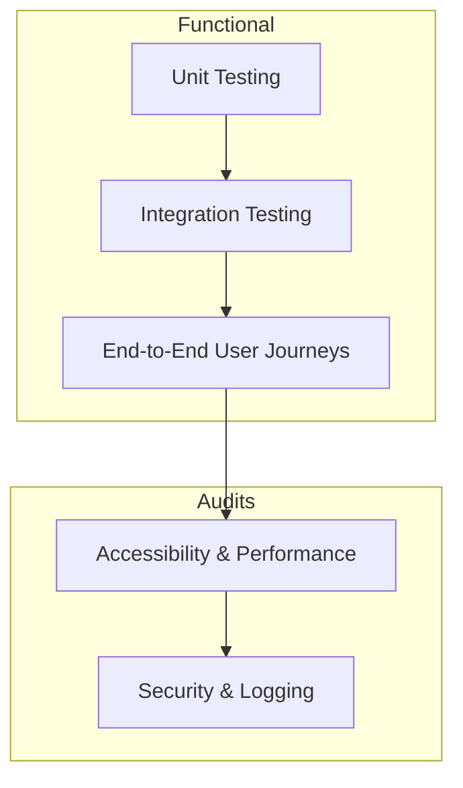

# QA Strategy Guide — CivicMind AI

This document details the multi-tiered quality assurance and testing strategy implemented for the CivicMind AI enterprise platform.

## 1. Testing Hierarchy

Our QA strategy divides quality check layers into five distinct categories:

- **Unit Testing**: Pytest-based coverage validating isolated functions, password complexities, spatial calculators, and schema parsing rules.
- **Integration Testing**: FastAPI TestClient and HTTPX AsyncClient routing validations checking endpoint response parameters, RBAC authorization, and error codes.
- **End-to-End Testing**: Multi-step user workflows (Citizen registering -> reporting issue -> AI orchestrator intent matching -> government officer dispatching).
- **Accessibility Testing**: Focus management, screen reader labels, WCAG 2.2 color contrasts, and keyboard navigation.
- **Performance Testing**: Dashboard latency audits, API processing benchmarks, and production bundle footprint analysis.

---

## 2. Multi-Agent Orchestration & Flow Validation

Given the Google ADK multi-agent architecture of CivicMind AI, specific validation guardrails are enforced:
- **Intent Routing**: Direct semantic query evaluation to route queries to the correct specialized agent.
- **Grounded Retrieval**: Verification that RAG knowledge models return valid context citations and prevent hallucinations.
- **Safety Guardrails**: Proactive scans targeting prompt injection attempts.

---

## 3. Test Suites Classification

- **Regression Suite**: Automatically triggered to verify modifications do not break existing modules.
- **Smoke Suite**: Executed in pre-release to verify database migrations, core authentication, and key dashboards are online.
- **Sanity Suite**: Executed after environment variables updates to confirm integration coordinates (e.g. Gemini API) are connected.
