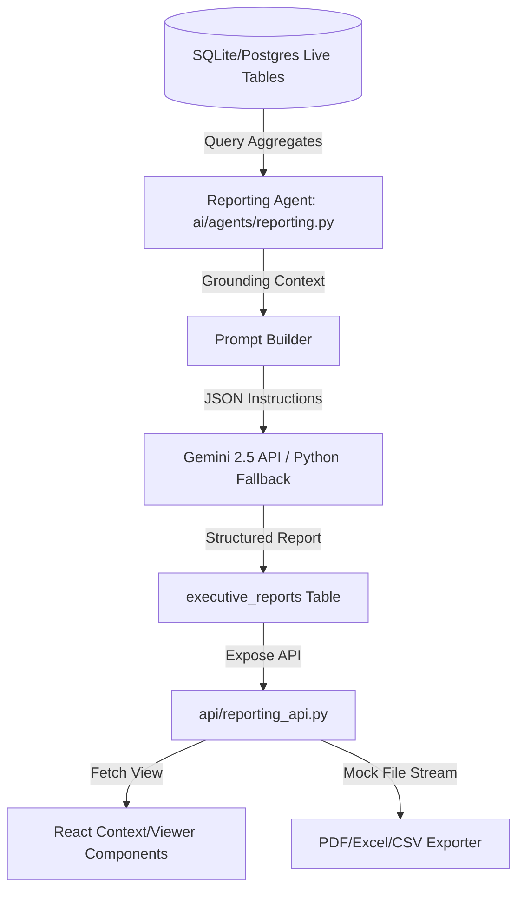

# AI Executive Reporting & Decision Briefing Platform Guide

This document describes the design, templates, and integration of the AI Executive Reporting & Decision Briefing Platform (Module 15) inside CivicMind AI.

---

## 1. System Architecture

The reporting system operates as an analytical overlay aggregating platform signals:

---

## 2. Report Templates & JSON Format

The engine supports various predefined report formats:
1. **Daily Executive Brief**: Quick operational summaries of the last 24h.
2. **Weekly Executive Report**: Mid-term trend monitoring and risk matrix evaluation.
3. **Monthly Performance Report**: Long-term KPI audits and resource budget advice.
4. **Healthcare Summary**: Clinic demand tracking, advisory views, and sanitary issues.
5. **Emergency Situation Report**: Incident command analysis and rescue resources.
6. **Department Performance Report**: Incident resolution time metrics per agency.
7. **Ward Performance Report**: Cross-ward hotspot analysis.
8. **Infrastructure Report**: Hazards, water works leaks, and road complaint totals.

Every report is returned as a JSON structure:
- **`executive_summary`**: Text overview.
- **`key_metrics`**: Numeric indicators grounded in active database counts.
- **`important_trends`**: List of observations.
- **`risk_assessment`**: Severity domains and likelihood matrixes.
- **`department_highlights`**: Agency productivity scorecards.
- **`geospatial_highlights`**: Ward hotspots map data points.
- **`ai_insights`**: Correlation findings.
- **`recommendations`**: Structured actions (Priority, Confidence, Evidence, responsible department, timeline).
- **`confidence_score`** & **`limitations`**: Technical quality score and constraints warning.

---

## 3. Decision Briefing Roles

Consice role-aware briefings are processed on-the-fly:
- **Mayor**: Core emergencies focus, budget authorizations, high-level resolution speeds.
- **Ward Officer**: Hotspot-focused cleanups and local ward sewer/utility grievance tasks.
- **Administrator**: Global user registry count, workflow execution audits, and IT rules performance.
- **NGO Coordinator**: Relocation operations, sanitary alerts, and volunteer deployment targets.

---

## 4. Document Export Providers

The export router (`POST /reports/export`) takes a target format and serves a downloable stream:
- **JSON**: Encodes the full raw response body.
- **CSV**: Compiles metric rows as comma-separated values.
- **PDF / Excel / PPTX**: Prepared via a modular helper interface allowing simple plug-in of reportlab, openpyxl, or pptx generation packages in future production phases.
