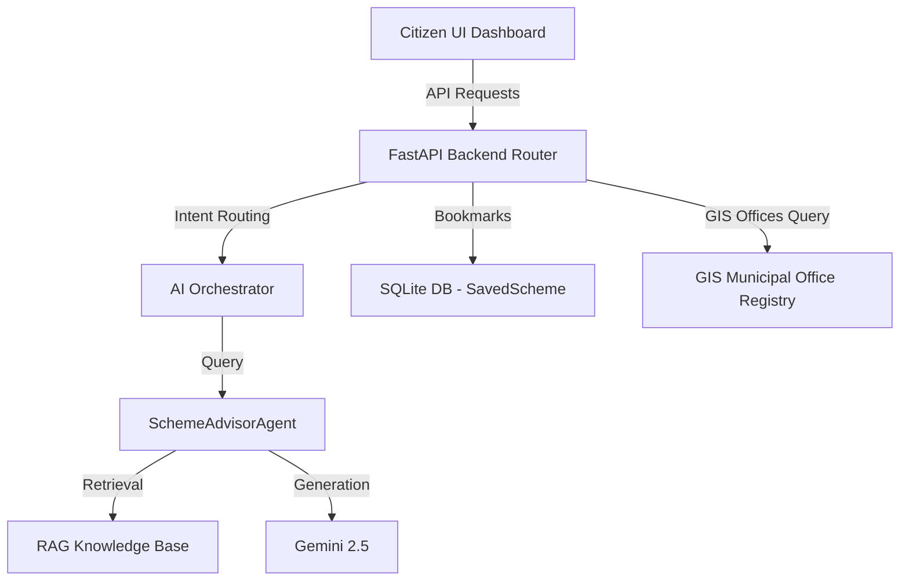

# Government Scheme Intelligence Agent - Developer Guide

This document describes the design, implementation, and interfaces of the **Government Scheme Intelligence Agent** (Module 11) for CivicMind AI.

## Architectural Overview

The Government Scheme Intelligence Agent is built on top of the Google ADK and Gemini AI models. It consists of the following components:

---

## 1. Database Model (`SavedScheme`)

Bookmarked schemes are stored in the `saved_schemes` SQLite table.
- **Model File**: [scheme.py](file:///c:/Users/Akshay/OneDrive/Desktop/New%20folder/CivicMind-AI/app/models/scheme.py)
- **Fields**:
  - `id`: Primary key (`Integer`)
  - `user_id`: Foreign key linked to `users.id` (`Integer`)
  - `scheme_id`: ID of the bookmarked scheme (`Integer`)
  - `scheme_title`: Title of the scheme (`String(200)`)
  - `scheme_category`: Category of the scheme (`String(100)`)
  - `created_at`: Datetime when saved (`DateTime`, UTC)

---

## 2. RAG Knowledge Layer

Official welfare schemes are indexed in the in-memory/vector knowledge base for RAG.
- **Knowledge File**: [layer.py](file:///c:/Users/Akshay/OneDrive/Desktop/New%20folder/CivicMind-AI/app/ai/knowledge/layer.py)
- **Supported Schemes**:
  1. **PM-KISAN** (Agriculture)
  2. **Startup India Seed Fund Scheme** (Startup Support)
  3. **Janani Suraksha Yojana (JSY)** (Healthcare)
  4. **Pradhan Mantri Kaushal Vikas Yojana (PMKVY)** (Skill Development)
  5. **Pradhan Mantri Awas Yojana (PMAY)** (Housing)
  6. **National Pension System (NPS)** (Pension)

---

## 3. API Handlers

The router exposes endpoints under `/api/v1/ai/schemes/`:
- `POST /chat`: Initiates multi-turn conversation with the agent.
- `GET /search`: Searches official schemes based on queries/categories.
- `POST /eligibility`: Reasoner checking citizen eligibility criteria in-memory.
- `GET /recommendations`: Fetches category or role-based personalized recommendations.
- `GET /compare`: Side-by-side comparison payload provider.
- `GET /offices`: Searches nearby municipal offices and registers distances using coordinates.
- `GET /resources`: Returns scheme FAQs.
- `POST /save`, `GET /saved`, `DELETE /saved/{id}`: Bookmark storage management.

---

## 4. Frontend Component Structure

The dashboard contains 7 specialized visual workspaces:
1. **Scheme Assistant**: Glassmorphic, modern chat box containing suggestions, confidence metrics, and agent source logs.
2. **Eligibility Triage**: Triage form with demographic selects triggering in-memory rule engine execution.
3. **Discovery & Search**: Lists cards with document lists, processing times, and department names.
4. **Compare Matrix**: Interactive comparison builder.
5. **Saved Cards**: Bookmark manager with card actions.
6. **Office Locator**: Leaflet GIS map highlighting coordinates pins for municipal help center locations.
7. **Analytics**: Overview of total queries, searches, and satisfaction scores.
